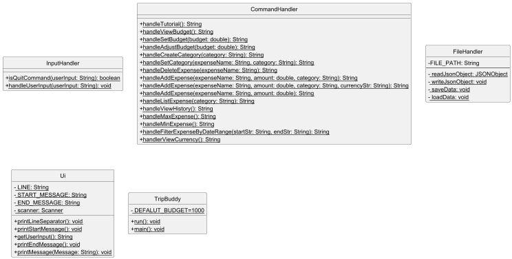
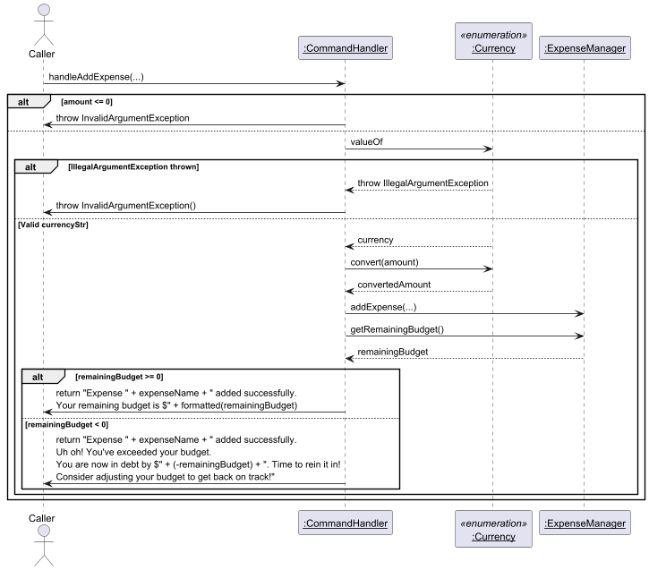
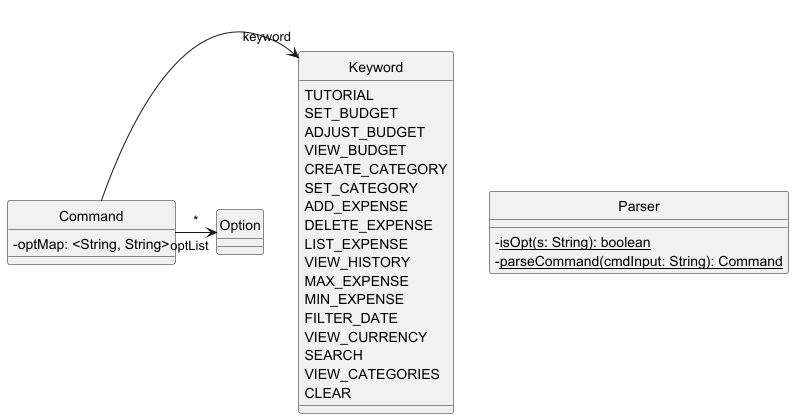
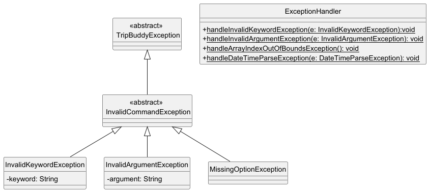

# Developer Guide
<!-- TOC -->
<!-- /TOC -->

## Acknowledgements

- [JSON-java](https://github.com/stleary/JSON-java): a third-party library for
JSON conversion and parsing.

## Design

This section describes some details on the design.

TripBuddy allows user interactions via a CLI, which is activated by `TripBuddy`.

The main framework consists of four layers: `CommandHandler`, `ExpenseManager`, `InputHandler` and `Ui`.



This layered design results in less conflicts while developing multiple
features, as well as ensuring testability of different modules.

### ExpenseManager

`ExpenseManager` stores all user data, and has direct CRUD access to them. It saves the **budget**, the **total expense** 
of the user so far, and the list of **categories**. 

Return values of methods of `ExpenseManager` are unprocessed, i.e. not parsed
into `String` or other formats for UI output. 


It manipulates the array of expenses and has methods to do the following tasks:
* Adds an expense 
* Deletes an expense
* Retrieves the maximum expense
* Retrieves the minimum expense
* Retrieves expenses by category or date

#### Expense
This is a class that saves the data of a specific expense made by the user. It holds important information such as
the name, the amount and the date the expenditure was made. The use of the category is optional.

The amount of the expense is calculated in the base currency. You can change the base currency using the command 
`set-base-currency`. 

#### Currency
This is an enumeration class explaining all the available currencies. The base currency is the one whose exchange rate
is one. The default base currency is SGD. 

### CommandHandler

`CommandHandler` is responsible for the following tasks:
- Collecting and manipulating data from `ExpenseManager` 

- Processing the output into `String` messages to be shown on UI

Parameters of `CommandHandler` methods should be parsed by `InputHandler` already. Every method corresponds to a 
command that can be done in the system. 

For example, in the following sequence diagram, we show how `handlerAddExpense` works.



### InputHandler

`InputHandler` is responsible for the following tasks:

- Analyzing user input and converting arguments into `Command` objects

- Invoking `CommandHandler` methods for command execution.

- Handling exceptions caused by user actions.

Inside this logic, we also find other classes. 



#### Command
This class keeps the information of a Command, such as, `view-currency` or `add-expense`. 
It has the following attributes: 
- Keyword: this keeps the information of the type of command (eg. `view-currency`)
- OptList: this keeps a list with the possible optional tokens (eg. `add-expense AMOUNT CURRENCY`)
- OptMap: this keeps information about the optional tokens. The keys are the names of the optional values
  (eg. '-c' if we want to input a currency when using 'add-expense') and the values are the actual values inputted
by the user. 

#### Keyword
This is an enumeration that indicates the different types of commands there are available.

#### Option

#### Parser

### Ui

The `Ui` class is responsible for displaying messages to the user via the command-line interface (CLI). It handles:
* Printing prompts and responses for user interactions.
* Displaying success and error messages.
* Formatting outputs for clarity and readability.
* Ensuring smooth user experience by maintaining a consistent UI flow.

### Exceptions 
We have defined different exception types to ensure that all errors are properly covered. 



## Implementation
This section describes an explanation on some of the implemented features. 

### Min-expense
Allows users to be informed on the lowest expense made in real-time.

### Max-expense
Allows users to be informed on the highest expense made in real-time

### Multi-currency support 
Allows users to have multi-currency expenses in the app.
#### **Step 1**: Conversion rates storage
We use a simple dictionary that maps currency codes to their conversion rates relative to the base
currency.

* For example:

```json
{
    "SGD": 1.0,
    "EUR": 1.1,
    "JPY": 0.009,
    "GBP": 1.3
}
``` 

We can also see the current currency rates available in our app using the command 
`view-currency`. This will display the above `json`. 

Moreover, we can also change the base currency. In order to do this, we will:
1. Recalculate existing expenses: all previously recorded expenses need to be recalculated to reflect their values in the new base currency. 
2. Update the budget: update the value of the budget so that is consistent with the current currency.
3. Recalculate Conversion Rates: divide all the values in the conversion dictionary by the current rate to that currency. 

We can see how we do it in the following sequence diagram. 


#### **Step 2**: Conversion logic
When an expense is added:
1. If a different currency is given, a conversion is needed
2. Multiply the expense amount by the conversion rate
3. The value in the base 


#### **Alternatives Considered**
- Keep the original value of the expense as well as the converted value. 

## Product scope
### Target user profile

**Target user profile**
- Individuals who are planning a trip or currently traveling.
- Budget-travelers who intend to establish a budget and track their expenses effectively.
- Users who prefer to use keyboard-based interactions over mouse-based navigation.
- Users who are comfortable using command-line interface (CLI) applications.

### Value proposition

TripBuddy helps travelers stay on top of their finances by simplifying expense tracking 
and budgeting during trips. TripBuddy provides an intuitive platform to log expenses and 
track spending in real time. By eliminating the confusion of manual calculations, TripBuddy
ensures a stress-free travel experience where everyone stays financially organized and accountable.
With features like real-time summaries, total spending insights, and visibility into your highest
and lowest expenses, TripBuddy empowers users to make informed financial decisions on the go.

## User Stories

| Version | As a ...        | I want to ...                          | So that I can ...                                               |
|---------|-----------------|----------------------------------------|-----------------------------------------------------------------|
| v1.0    | new user        | see usage instructions                 | refer to them when I forget how to use the app                  |
| v1.0    | budget-traveler | set a travel budget                    | monitor spending to avoid overspending during the trip          |
| v1.0    | user            | add an expense                         | track my expenses and total remaining budget.                   |
| v1.0    | user            | delete an expense                      | correct an earlier mistake.                                     |
| v1.0    | user            | view my remaining budget               | see how much money I have left to spend.                        |
| v1.0    | user            | view past expenses                     | review my past expenses for accuracy                            |
| v2.0    | user            | adjust my total budget                 | modify my spending habits accordingly.                          |
| v2.0    | user            | see total amount spent                 | understand my overall spending up to date                       |
| v2.0    | user            | see minimum and maximum expense        | identify the smallest and largest purchases I've made           |
| v2.0    | user            | add an expense in a different currency | add expenses in the local currency and not think about the rate |
| v2.0    | user            | save/load the information of a trip    | i don't have to keep adding expenses every time                 |

## Non-Functional Requirements

* Performance: The application should process user commands within 1 second.
* Usability: The system should have an intuitive CLI interface with clear error messages and user guidance.
* Reliability: TripBuddy should be able to handle at least 100 expense entries without crashing.
* Portability: The application should be compatible with Windows, macOS, and Linux environments.
* Scalability: The system should allow future enhancements, such as more expense categories, without significant rework.

## Glossary

* *expense* - a record of a purchase made by the user, stored as an `Expense`
entity.
* *budget* – a spending limit set by the user to track expenses and manage finances during a trip.
* *category* – a classification assigned to an expense (e.g., Food, Transport) to help users organize their spending.

## Instructions for manual testing

Testing Budgeting Features:
* Set a budget using the set-budget command and verify that the amount is correct.
* Add and delete expenses to confirm that budget calculations update correctly.
* Use the adjust-budget command to modify the budget and ensure that all dependent calculations reflect the changes.

Testing Command Handling:
* Run all supported commands and check for correct execution and expected output.
* Input invalid commands and confirm that proper error messages are displayed.

Verifying UI Responses:
* Ensure that the CLI provides appropriate feedback for each user action.
* Test edge cases such as invalid formats and unexpected inputs.

Checking Exception Handling:
* Deliberately introduce invalid data to ensure the system appropriately handles errors without crashing.
